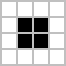
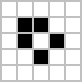
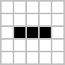
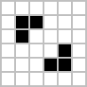
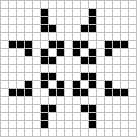
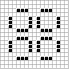
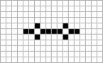
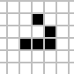

# Assignment 4 (en)

(English Version)

Game of Life

Complete the source code according to the instructions below. A suite of test cases are present and they ensure us that the implementation has a minimal set of requested features implemented.

The Game of Life is a cellular automaton devised by the British mathematician John Horton Conway in 1970. The "game" is a zero-player game, meaning that its evolution is determined by its initial state, requiring no further input. One interacts with the Game of Life by creating an initial configuration and observing how it evolves, or, for advanced "players", by creating patterns with particular properties.

## Rules

- The universe of the Game of Life is an infinite two-dimensional orthogonal grid of square cells, each of which is in one of two possible states, alive or dead, or "populated" or "unpopulated" (the difference may seem minor, except when viewing it as an early model of human/urban behavior simulation or how one views a blank space on a grid). Every cell interacts with its eight neighbors, which are the cells that are horizontally, vertically, or diagonally adjacent.
- At each step in time, the following transitions occur:
  - Any live cell with fewer than two live neighbours dies, as if caused by under-population.
  - Any live cell with two or three live neighbours lives on to the next generation.
  - Any live cell with more than three live neighbours dies, as if by over-population.
  - Any dead cell with exactly three live neighbours becomes a live cell, as if by reproduction.
- The initial pattern constitutes the seed of the system. The first generation is created by applying the above rules simultaneously to every cell in the seed—births and deaths occur simultaneously, and the discrete moment at which this happens is sometimes called a tick (in other words, each generation is a pure function of the preceding one). The rules continue to be applied repeatedly to create further generations.
- A dead cell will contain value 0; a living cell will contain 1 or any positive number.
- The application will ask user for grid size or will chose by default a grid of at least 20x20, the grid cannot be smaller than 20x20.
- The user should be able to set number of ticks for the game to run. At each tick the entire matrix is updated according to given rules.

## Patterns

Beside the rules described above the developer should implement methods that draw these popular patterns:

- Still life, they don’t change over time.
  - Block  
    
  - Boat  
    
- Oscillators, they have a repetitive pattern over time, with repetition period 2 to 15 ticks.
  - Blinker (period 2)  
    
  - Beacon (period 2)  
    
  - Pulsar (period 3) (optional)  
      
      
  - Pentadecathlon (period 15) (optional)  
    
- Spaceship, repetitive patterns that move across the grid.
  - Glider  
    

## Naming

The methods used for drawing the common patterns should have a prototype like the following:

```cpp
DrawShape(<desired shape>, <starting coordinate X>, <starting coordinate Y>);
//Example:
DrawShape(BEACON, 10,15);
```

## Hints

- Implemented shapes name could be stored inside an enumerator.
- The grid is a bidimensional matrix, global variable.
